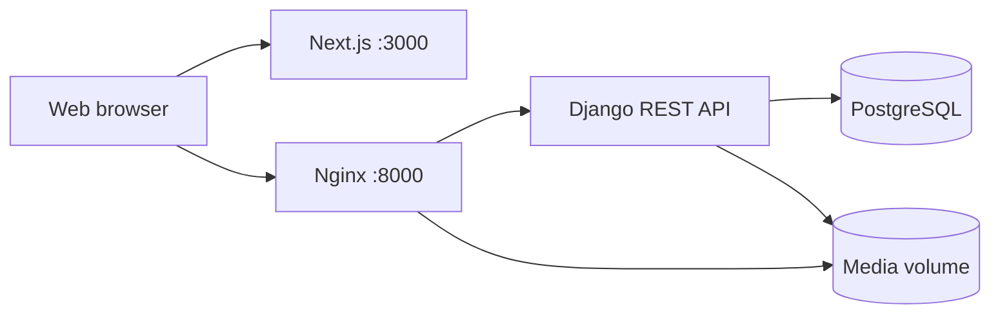

# SoundWave

SoundWave is a full-stack music-streaming service inspired by Spotify. It was developed as the Spring 2026 Web Programming course project at Sharif University of Technology.

The project combines a responsive, role-aware Next.js frontend with a Django REST Framework backend. It supports listeners, approved artists, support agents, and one system administrator. The delivery version includes persistent authentication, media uploads, subscriptions, payments, reports, artist accounting, and complete frontend-backend integration.

For a source-oriented tour of every subsystem, endpoint, state provider, workflow, test area, and known sharp edge, read [`docs/codebase-catch-up.md`](docs/codebase-catch-up.md).

## Table of Contents

- [Team and responsibilities](#team-and-responsibilities)
- [Implemented requirements](#implemented-requirements)
- [Technology stack](#technology-stack)
- [System architecture](#system-architecture)
- [Project structure and design rationale](#project-structure-and-design-rationale)
- [Backend models and relationships](#backend-models-and-relationships)
- [REST and access-control design](#rest-and-access-control-design)
- [Development process and conventions](#development-process-and-conventions)
- [Maintainability](#maintainability)
- [Repository data and demonstration accounts](#repository-data-and-demonstration-accounts)
- [Running with Docker Compose](#running-with-docker-compose)
- [Running without Docker](#running-without-docker)
- [Verification and tests](#verification-and-tests)
- [Important workflows](#important-workflows)
- [AI-assisted development](#ai-assisted-development)
- [Optional work](#optional-work)
- [Known boundaries](#known-boundaries)

## Team and Responsibilities

Work was divided by feature ownership. Every member contributed in both phases; API contracts, integration, regression testing, and final validation were shared responsibilities.

| Team member | Student ID | Phase 1: frontend | Phase 2: backend and integration |
|---|---:|---|---|
| Arshia Vashani | 400108728 | Home, login, signup, forgot-password, profile, settings, notifications | Accounts, authentication, user profiles and preferences, follows, notifications, subscriptions, payment flow, and related frontend integration |
| Narges Sepehri (Mira) | 401106028 | Music catalog, album pages, playlists, player components, and track/album interactions | Music and album models, upload flow, playlists, verified streams, listening history, subscription limits, recommendation integration, and related frontend integration |
| Poorya Amirniya | 401170518 | Artist dashboard, support dashboard, admin dashboard, tables, tickets, artist approvals, and accounting UI | Initial backend integration, artist applications and approvals, support tickets, dynamic pricing, role-specific reports, artist accounting, settlement flow, and related frontend integration |

The division above identifies primary ownership, not exclusive authorship. Cross-domain changes were reviewed against the project statement and tested through complete user workflows.

## Implemented Requirements

### Phase 1: frontend

| Project-statement section | Implementation |
|---|---|
| 2.1 - Login and signup | Listener/artist registration, login, logout, forgot-password flow, validation, and role-aware redirect |
| 2.2 - Home | Personalized sections, recent listening, new/popular content, subscription prompt, and recommendation cards |
| 2.3 - User profile | Public/private profile data, avatar, follow/unfollow, follower/following statistics, and account management |
| 2.4 - Artist profile | Verified identity, images, biography, releases, followers, and public artist navigation |
| 2.5 - Settings | Language, sound, notification preferences, subscription purchase/renewal, and account deletion |
| 2.6 - Notifications | Categories, read/unread state, mark-all-read, deletion, action links, and preference-aware delivery |
| 2.7 - Playlists | Empty state, create/edit/delete, covers, ordered tracks, add/remove, playback, and plan limits |
| 2.8 - Albums and singles | Search, artist/title filtering, ordering, album/single cards, links, and playlist actions |
| 2.9 - Music player | Play/pause, seeking, volume, previous/next, queue, shuffle, repeat, cover, lyrics, and linked metadata |
| 2.10 - Artist work management | Single/album upload, metadata, collaborators, lyrics, cover/audio, edit/delete, statistics, and accounting |
| 2.11 - Support/admin dashboard | Artist approval with samples, ticket conversation, accounting, settlement, dynamic pricing, and system reports |

The frontend includes reusable loading, empty, error, confirmation, table, card, modal, tab, and form states and more than the required ten frontend tests.

### Phase 2: backend and integration

| Project-statement section | Implementation |
|---|---|
| 3.1 - Models and REST CRUD | Domain models, validation, constraints, indexes, serializers, ViewSets, and only the CRUD operations required by each resource |
| 3.2 - Subscriptions | Basic, Silver, and Gold plans; 1/3/6/12-month periods; renewal; expiry; seven-day warning; dynamic prices and plan-specific limits |
| 3.3 - Access control | Backend-enforced role, ownership, and subscription permissions; one active administrator; scoped report and financial access |
| 3.4 - Music and image uploads | Multipart audio/image upload, extension and size validation, separate storage paths, protected audio delivery, and cleanup of temporary/replaced files |
| 3.5 - Persistent preferences | User preferences and notification settings stored in the backend and synchronized across signed-in devices |
| 3.6 - Payment gateway | Pending/success/failed/canceled transactions, an idempotent callback, a deterministic local sandbox, and an optional Zarinpal adapter |
| 3.7 - Reports | Backend aggregation for artists, support agents, and the administrator; subscription distribution, verified sales, ticket/application counts, streams, listeners, and revenue |
| 3.8 - Frontend integration | Runtime pages use the Django API for authentication, catalogs, playlists, player events, settings, dashboards, payments, and notifications |
| 3.9 - Dockerization (optional) | PostgreSQL, Django/Gunicorn, Nginx, and Next.js start together with Docker Compose |

Additional implemented behavior includes account anonymization, follows, listening history, early access, download authorization, price-change history, persistent notifications, support-ticket assignment/internal notes/status transitions, and administrator-confirmed artist settlements.

## Technology Stack

### Frontend

- Next.js 16 App Router
- React 18
- TypeScript
- Tailwind CSS
- ESLint
- Native Node.js test runner

### Backend

- Python 3.13 in the delivery container
- Django
- Django REST Framework
- DRF token authentication
- PostgreSQL in Docker and SQLite for optional local development
- Pillow and `django-cors-headers`
- Gunicorn

### Infrastructure

- Docker and Docker Compose
- Nginx API/media gateway
- Named PostgreSQL, media, and static-file volumes

## System Architecture



The browser loads the Next.js application from port `3000` and sends API requests to the Nginx gateway on port `8000`. Nginx forwards API and Django-admin requests to Gunicorn, serves safe media/static paths, and blocks direct access to track-audio storage. Track playback and downloads therefore pass through signed, permission-checked backend endpoints. PostgreSQL and uploaded media persist in named Docker volumes.

## Project Structure and Design Rationale

```text
app/                         Next.js App Router pages
components/
  layout/                    Shared page shells and navigation
  player/                    Player presentation components
  shared/                    Reusable domain-level components
  ui/                        Primitive controls such as Button, Modal, and Table
config/                      Navigation and route-access declarations
features/
  account/                   Account, settings, notification, and subscription APIs
  music/                     Catalog, album, track, player, and playlist APIs
  operations/                Artist, support, admin, pricing, and report APIs
hooks/                       Reusable React hooks
lib/                         Token-aware API client, permissions, labels, and formatters
providers/                   Authentication, player, app settings, and preference state
tests/                       Frontend unit/component/API-contract tests
types/                       Shared TypeScript contracts
public/mock/                 Version-controlled Phase 1 demonstration assets

backend/
  accounts/                  Registration, authentication, profiles, preferences, follows
  artists/                   Applications, samples, review, and approved artist profiles
  music/                     Genres, albums, tracks, streams, and listening history
  playlists/                 Playlist CRUD, ordered items, playback, and plan limits
  subscriptions/             Payments, activation, renewal, warnings, and expiry
  notifications/             Persistent user notifications and domain-event receivers
  support/                   Tickets, messages, assignment, priority, and status flow
  operations/                Subscription plans and price-change audit history
  reports/                   Backend aggregation, accounting records, and settlements
  common/                    Shared models, permissions, pagination, health, and errors
  config/                    Django settings and root URL configuration

docker/                      Nginx configuration
docs/                        Working report material
docker-compose.yml           Four-service delivery environment
```

### Frontend rationale

Route components remain in `app/`, reusable presentation is in `components/`, server communication is grouped by business feature in `features/`, and shared state is isolated in providers. This avoids embedding API details inside every page and makes components testable with mocked navigation and requests. `lib/api.ts` centralizes token attachment, JSON/FormData handling, error extraction, and automatic token removal after unauthorized responses.

### Backend rationale

Django apps follow business domains rather than technical layers. Each app owns its models, serializers, services, permissions, views, URL contracts, signals, migrations, tests, and short documentation. Views handle HTTP concerns, serializers validate request/response contracts, and service functions own transactional business rules. Signals are used only for decoupled domain notifications and default-plan initialization.

This structure keeps changes local. For example, changing payout calculation affects `reports`, while changing playlist limits affects `playlists`, `operations`, and subscription helpers through explicit contracts rather than scattered UI constants.

## Backend Models and Relationships

Django's built-in `User` model is the identity root. All business models inherit timestamps from the abstract `TimestampedModel` where appropriate.

| Domain | Models | Main relationships and reason |
|---|---|---|
| Accounts | `UserProfile`, `UserPreference`, `UserFollow` | One profile and one preference row per user; directed follow rows model follower/following without duplicating user data |
| Artists | `ArtistApplication`, `ArtistSampleWork`, `ArtistProfile` | A user may submit applications containing file or URL samples; approval creates one artist profile linked one-to-one with the user |
| Music | `Genre`, `Album`, `Track`, `StreamEvent`, `ListeningHistory` | Artists own albums/tracks; a track may belong to one album and many collaborator artists; verified stream events and per-user history remain separate because they serve accounting and personalization differently |
| Playlists | `Playlist`, `PlaylistItem`, `PlaylistPlayback` | A user owns playlists; the through model preserves unique ordered tracks and who added them; playback state is tracked per user and playlist |
| Operations | `SubscriptionPlan`, `SubscriptionPriceChange` | Plan capabilities/prices are database data rather than source constants; every administrator price change has an audit row |
| Subscriptions | `UserSubscription`, `PaymentTransaction` | Time-bounded subscriptions reference protected plans; payment attempts remain separate so pending, failed, canceled, and verified outcomes are auditable |
| Notifications | `Notification` | Each persistent notification belongs to one recipient and carries category, read time, message, and optional action path |
| Support | `Ticket`, `TicketMessage` | A requester owns a ticket, assignment is optional, and ordered public replies/internal notes retain their sender |
| Reports | `ArtistRevenueRecord` | One protected artist-period aggregate stores counts, gross/fee/net values, per-track breakdown, and settlement metadata |

Important database safeguards include:

- no self-follow and no duplicate follow;
- at most one pending application per applicant;
- exactly one source (uploaded file or external URL) per artist sample;
- unique album track numbers and playlist ordering;
- unique stream sessions and listener/track history rows;
- payment periods restricted to `1`, `3`, `6`, or `12` months;
- Basic always free, Silver and Gold always positive, and capabilities fixed to their tiers;
- no overlapping accounting records for the same artist and reporting period;
- platform fee never greater than gross revenue;
- one active system administrator, enforced when a user is saved.

`PROTECT` is used where audit history must survive account or plan changes, `SET_NULL` is used where the business record must remain after an optional reviewer/assignee is removed, and `CASCADE` is used only for data that has no independent meaning without its owner.

## REST and Access-Control Design

API groups:

- `/api/accounts/`
- `/api/artists/`
- `/api/music/`
- `/api/playlists/`
- `/api/subscriptions/`
- `/api/notifications/`
- `/api/support/`
- `/api/operations/`
- `/api/reports/`

Only meaningful operations are exposed. Registration/login, artist review, stream reporting, download authorization, payment verification, price update, revenue generation, and settlement are explicit actions rather than artificial generic CRUD. Public profile serializers exclude email and authentication metadata. Raw report rows are not sent to React for aggregation; Django returns already-computed totals.

### Role permissions

| Role | Main access |
|---|---|
| Listener | Playback, public catalog/profiles, own playlists, follows, settings, subscriptions, notifications, and own support tickets |
| Approved artist | Listener access plus own releases, media management, artist statistics, and own accounting reports |
| Support | Pending artist applications and support-ticket operations; no subscription pricing, financial reports, or settlement |
| Administrator | Support capabilities plus dynamic prices, system reports, accounting generation, and payout settlement |

Role, ownership, and subscription checks are enforced by the backend even if a control is hidden in the frontend. Artists cannot modify another artist's releases, users cannot access another user's private notifications/tickets, support agents cannot read financial records, and only the administrator can change prices or settle a payout.

### Subscription permissions

| Capability | Basic | Silver | Gold |
|---|---:|---:|---:|
| Counted streams per day | 60 | Unlimited | Unlimited |
| Playlists | 6 | 100 | Unlimited |
| Profile-image upload | No | Yes | Yes |
| Track download | No | Yes | Yes |
| Early-access releases | No | No | Yes |
| Advanced statistics | No | No | Yes |

## Development Process and Conventions

### Git workflow

- `main` represents the integrated, deliverable state.
- Feature branches use names such as `feature/<domain>-phase2`.
- Corrections use focused names such as `fix/<issue>`; documentation uses `docs/<topic>`.
- Commit subjects use short Conventional Commit-style prefixes such as `feat:`, `fix:`, `test:`, `refactor:`, and `docs:`.
- Changes are integrated only after reviewing the diff and running the relevant focused tests; complete verification is run before final delivery.

### Naming and contracts

- Python modules, functions, local variables, and database fields use `snake_case`.
- Python classes and Django models use `PascalCase`.
- TypeScript variables/functions use `camelCase`; components and types use `PascalCase`.
- REST JSON uses `camelCase`, while serializers explicitly map it to Django's `snake_case` fields.
- URLs use plural, resource-oriented nouns and explicit action suffixes only for business operations.
- Dates use ISO 8601, identifiers are serialized as strings, currency values are integer minor units (cents), and API errors use a consistent JSON structure.

### Definition of done

A change is considered complete after:

1. validation and permission behavior are implemented in the backend;
2. the frontend handles loading, success, empty, validation, and error states;
3. migrations are included when the schema changes;
4. focused and regression tests pass;
5. TypeScript checking, linting, Django checks, and the production build pass;
6. the end-to-end workflow is manually exercised with the correct role and subscription.

Environment values and secrets belong in `.env` or `.env.local`, both of which are ignored by Git. No production credential is committed.

## Maintainability

- Reusable React UI primitives prevent each page from reimplementing buttons, forms, modals, tables, badges, and confirmations.
- One API client owns authentication headers, JSON/FormData behavior, error parsing, and query serialization.
- Domain API modules keep endpoint details out of page components.
- TypeScript domain contracts make frontend/backend mismatches visible during type checking.
- Django services separate transactional rules from HTTP views and UI behavior.
- DRF serializers and permission classes centralize validation and access control.
- Database constraints protect invariants even when an API request bypasses the frontend.
- `transaction.atomic`, `select_for_update`, idempotent verification, and unique constraints protect concurrency-sensitive payments, stream limits, reviews, and settlements.
- Signals decouple notification creation from artist, release, support, report, and subscription workflows.
- Aggregation is performed in Django/SQL, reducing duplicated report math in React.
- Each backend domain has its own tests and README, so a new contributor can change one area without reading the entire system first.
- Docker fixes the delivery versions of PostgreSQL, Python, Node.js, Nginx, and runtime commands.

## Repository Data and Demonstration Accounts

### What is and is not stored in Git

Runtime data created during manual testing is **not** stored in GitHub:

- Docker PostgreSQL data is in the local `postgres_data` named volume.
- Uploaded audio/images are in the local `media_data` named volume.
- local SQLite databases, `backend/media/`, environment files, and build output are ignored by Git.
- Django tests use a temporary test database and do not populate the normal runtime database.

The repository does contain migrations, the subscription-plan bootstrap signal, Phase 1 mock assets under `public/mock/`, and legacy Phase 1 fixture modules under `data/`. Migrations recreate the Basic, Silver, and Gold plans (`0`, `699`, and `1199` cents by default), but they do not recreate manually uploaded songs, manual transactions, or the `manual.*` accounts used during final testing. The legacy `data/` modules are retained for isolated Phase 1 regression tests and are not runtime Django data.

### Create four local delivery accounts

The following command is intended only for a fresh local demonstration database. It creates reproducible accounts for all four roles. The passwords are public course-demo credentials and must never be reused in a deployed system.

```powershell
docker compose exec backend python manage.py shell -c "from django.contrib.auth import get_user_model; from django.contrib.auth.models import Group; from django.utils import timezone; from artists.models import ArtistProfile; U=get_user_model(); listeners,_=Group.objects.get_or_create(name='listener'); support_group,_=Group.objects.get_or_create(name='support'); admin,_=U.objects.get_or_create(username='soundwave-admin'); admin.email='admin@soundwave.local'; admin.is_active=True; admin.is_staff=True; admin.is_superuser=True; admin.set_password('SoundWave_Admin_1405!'); admin.save(); support,_=U.objects.get_or_create(username='soundwave-support'); support.email='support@soundwave.local'; support.is_active=True; support.is_staff=False; support.is_superuser=False; support.set_password('SoundWave_Support_1405!'); support.save(); support.groups.set([support_group]); listener,_=U.objects.get_or_create(username='soundwave-listener'); listener.email='listener.demo@soundwave.local'; listener.is_active=True; listener.is_staff=False; listener.is_superuser=False; listener.set_password('SoundWave_Listener_1405!'); listener.save(); listener.groups.set([listeners]); listener.profile.display_name='Demo Listener'; listener.profile.save(update_fields=['display_name','updated_at']); artist,_=U.objects.get_or_create(username='soundwave-artist'); artist.email='artist.demo@soundwave.local'; artist.is_active=True; artist.is_staff=False; artist.is_superuser=False; artist.set_password('SoundWave_Artist_1405!'); artist.save(); artist.groups.set([listeners]); artist.profile.display_name='Demo Artist'; artist.profile.save(update_fields=['display_name','updated_at']); artist_profile,_=ArtistProfile.objects.get_or_create(user=artist,defaults={'stage_name':'Demo Artist'}); artist_profile.stage_name='Demo Artist'; artist_profile.is_approved=True; artist_profile.verified_at=timezone.now(); artist_profile.verified_by=admin; artist_profile.save(); print('Created/updated local delivery accounts.')"
```

| Role | Email | Password |
|---|---|---|
| Administrator | `admin@soundwave.local` | `SoundWave_Admin_1405!` |
| Support | `support@soundwave.local` | `SoundWave_Support_1405!` |
| Approved artist | `artist.demo@soundwave.local` | `SoundWave_Artist_1405!` |
| Listener (Basic) | `listener.demo@soundwave.local` | `SoundWave_Listener_1405!` |

SoundWave permits only one active superuser. Do not run the account-bootstrap command after creating a different administrator. On a non-fresh database, use the existing administrator and create listener/artist accounts through `/signup`, then approve the artist from `/support`.

These accounts provide roles, not sample songs or financial history. To demonstrate media and reports on a clean machine, sign in as the approved artist and upload a release, play it with the listener long enough to register a counted stream, then generate an accounting record as the administrator.

## Running with Docker Compose

Docker is the recommended delivery path because it starts the same four services on every machine.

### Prerequisites

- Git
- Docker Desktop or Docker Engine with Docker Compose
- Free local ports `3000` and `8000`

### First run

From the repository root:

```powershell
docker compose up -d --build
docker compose ps
```

The backend waits for PostgreSQL, applies migrations, collects static files, and starts Gunicorn. The frontend build receives `http://localhost:8000/api` as its public API base URL.

Expected services:

```text
database
backend
gateway
frontend
```

Open:

| Service | Address |
|---|---|
| SoundWave frontend | `http://localhost:3000` |
| API health check | `http://localhost:8000/api/health/` |
| Django administration | `http://localhost:8000/admin/` |
| API prefix | `http://localhost:8000/api/` |

Useful commands:

```powershell
# Follow logs
docker compose logs -f --tail=200 backend gateway frontend

# Rebuild after dependency or Dockerfile changes
docker compose up -d --build --force-recreate

# Stop while preserving database and uploaded media
docker compose down
```

To intentionally delete the local Docker database and uploaded media and start from a completely clean state, use `docker compose down -v`. This cannot be undone.

## Running without Docker

Local execution uses SQLite by default and requires two terminals.

### Prerequisites

- Node.js 20+
- Python 3.13 (Python 3.11+ is expected to work with the pinned dependencies)

### Install and configure

From the repository root in PowerShell:

```powershell
Copy-Item .env.local.example .env.local
Copy-Item .\backend\.env.example .\backend\.env

npm ci

py -m venv .\backend\.venv
Set-ExecutionPolicy -Scope Process -ExecutionPolicy Bypass
. .\backend\.venv\Scripts\Activate.ps1
python -m pip install -r .\backend\requirements.txt

cd backend
python manage.py migrate
python manage.py check
cd ..
```

Leaving `POSTGRES_DB` empty in `backend/.env` selects SQLite. The default local payment gateway is the deterministic sandbox.

### Terminal 1: backend

```powershell
cd backend
. .\.venv\Scripts\Activate.ps1
python manage.py runserver 127.0.0.1:8000
```

### Terminal 2: frontend

```powershell
npm run dev
```

Open `http://localhost:3000`.

## Verification and Tests

### Backend in Docker

```powershell
docker compose exec backend python manage.py makemigrations --check --dry-run
docker compose exec backend python manage.py check
docker compose exec backend python manage.py test -v 2
```

### Frontend from the repository root

```powershell
npm ci
npm run test
npm run type-check
npm run lint
npm run build
```

Last verified delivery result:

```text
Backend: 121 tests passed
Frontend: 29 tests passed
Django migration check: no changes detected
Django system check: no issues
TypeScript type-check: passed
ESLint: passed
Next.js production build: passed (15 generated routes)
```

Backend coverage includes registration/login, privacy-safe profiles, account anonymization, artist review, upload validation and ownership, stream counting and daily limits, early access, playlists, plan restrictions, payments, subscription expiry, notification ownership/preferences, support tickets, reporting, accounting, settlement, and dynamic prices.

Frontend coverage includes shared helpers/components and API integration contracts. The final version was also manually exercised across listener, artist, support, and administrator workflows because automated tests alone do not validate the complete browser interaction.

## Important Workflows

### Artist approval

1. Register an artist from `/signup` with at least one sample file or external sample link.
2. Sign in as Support or Administrator and open `/support`.
3. Review sample work, then approve or reject with a reason.
4. Approval creates/enables the artist profile and sends a persistent notification.
5. The approved artist can use `/artist-dashboard` to upload and manage releases.

### Verified stream and accounting

1. The player creates/reuses a unique stream session and reports listened seconds.
2. The backend marks a stream as counted only after the required listening threshold and applies the Basic daily limit transactionally.
3. Counted events update listening history and become the source for artist/admin reports.
4. The administrator chooses a reporting period, currency, per-stream rate, per-unique-listener rate, and platform-fee percentage.
5. Django computes:

   ```text
   gross = stream_count * per_stream_cents
         + unique_listener_count * per_unique_listener_cents

   platform_fee = floor(gross * platform_fee_percent / 100)
   artist_payout = gross - platform_fee
   ```

6. An overlapping artist-period record is rejected. A new record starts as `pending` and includes a per-track breakdown.
7. Only the administrator can mark it `settled`; the action stores the time and administrator and notifies the artist.

The project statement refers to a reward formula but does not provide its promised numeric constants. Rates are therefore explicit administrator inputs rather than hidden frontend constants.

### Subscription purchase and expiry

1. The user selects Silver or Gold and a `1`, `3`, `6`, or `12` month period.
2. The quoted total uses the current database price.
3. A pending transaction is created before redirection.
4. Only successful gateway verification activates or extends a subscription; callbacks are idempotent.
5. Expired subscriptions fall back to Basic, and one warning is created when an active subscription is within seven days of expiry.

The lifecycle is refreshed during relevant normal requests. An idempotent command is also available for scheduled execution:

```powershell
docker compose exec backend python manage.py process_subscription_expiry
```

### Dynamic pricing

Basic remains free. The administrator may change Silver and Gold monthly prices from `/admin`; Gold must remain at least as expensive as Silver. Quotes and future transactions immediately use the persisted values, and every change records old price, new price, administrator, and time.

### Payment modes

The default delivery configuration is:

```text
PAYMENT_GATEWAY=local
```

The local sandbox returns a deterministic callback and allows the complete transaction/verification/subscription flow to be demonstrated without external credentials. To use Zarinpal, set `PAYMENT_GATEWAY=zarinpal`, configure `ZARINPAL_MERCHANT_ID`, use IRR plan pricing, and provide network access to the gateway.

## AI-Assisted Development

AI-assisted tools were used as development aids for design alternatives, repetitive scaffolding, test-case ideas, code review, debugging hypotheses, and comparing the implementation with the long project statement. They were not treated as an authoritative source. Team members selected the architecture, reviewed and adapted suggestions, ran migrations and automated tests, performed role-based manual tests, inspected database state, and corrected integration defects before accepting changes.

### Example from Phase 1

The initial draft of a reusable confirmation component was prepared with AI assistance and then reviewed and adapted to the project's component conventions. The final code is in `components/shared/ConfirmDialog.tsx`:

```tsx
interface ConfirmDialogProps {
  open: boolean;
  title: string;
  description: string;
  onCancel: () => void;
  onConfirm: () => void;
}

export function ConfirmDialog({ open, title, description, onCancel, onConfirm }: ConfirmDialogProps) {
  return (
    <Modal onClose={onCancel} open={open} title={title}>
      <p>{description}</p>
      <Button onClick={onCancel}>Cancel</Button>
      <Button onClick={onConfirm} variant="danger">Confirm</Button>
    </Modal>
  );
}
```

The useful contribution was identifying a reusable prop-based pattern; human review aligned imports, styling, labels, keyboard/modal behavior, and each destructive workflow with the rest of the UI.

### Example from Phase 2

AI assistance was used to propose ownership-permission edge cases and an initial permission shape. The reviewed implementation is in `backend/music/permissions.py` and is backed by API tests:

```python
class IsOwnerArtistOrReadOnly(BasePermission):
    def has_permission(self, request, view) -> bool:
        if request.method in SAFE_METHODS:
            return bool(request.user and request.user.is_authenticated)
        profile = getattr(request.user, "artist_profile", None)
        return bool(request.user.is_superuser or (profile and profile.is_approved))

    def has_object_permission(self, request, view, obj) -> bool:
        if request.method in SAFE_METHODS:
            return True
        profile = getattr(request.user, "artist_profile", None)
        return bool(request.user.is_superuser or (profile and profile.pk == obj.artist_id))
```

The team verified both successful owner operations and forbidden cross-artist operations rather than accepting the generated suggestion by inspection.

### Observed strengths and weaknesses

| Area | Strengths | Weaknesses requiring human work |
|---|---|---|
| Frontend | Quickly proposed reusable components, typed API contracts, loading/error states, and regression-test cases; helped compare many pages with the specification | Could not judge complete browser behavior from isolated code; replacing Phase 1 mock state with asynchronous API data produced stale/missing edit fields and interaction regressions that were found by manual testing |
| Backend | Accelerated serializer/service/test scaffolding, permission matrices, validation edge cases, and audits against the specification | Made framework-specific assumptions about PostgreSQL row locking, nullable joins, media directories, file cleanup, and protected audit rows; these required real migrations, concurrent/negative tests, and database inspection |
| Integration | Helped trace request/response mismatches and generate cross-role checklists | Sometimes assumed a command worked the same in Bash, PowerShell, and Django's test client; actual host, quoting, environment, and Docker behavior still required local verification |

Concrete issues found and resolved during team review and manual testing included:

- creating the album-cover storage directory before saving and removing temporary uploads after success or failure;
- creating missing artist settings safely instead of returning `500`;
- returning all required track metadata so the artist edit form shows title, album, genre, and collaborators;
- limiting `select_for_update` to lockable rows to avoid PostgreSQL errors on nullable outer joins in account, ticket, and review workflows;
- replacing impossible hard deletion with irreversible anonymization because payment/support audit rows use `PROTECT`;
- separating public and private user serializers so public profiles do not expose email/authentication metadata;
- restricting financial reports to approved artists viewing their own data and the administrator, not Support;
- ensuring notification preferences suppress followed-artist releases without suppressing artist-account approval/rejection notices;
- moving accounting totals and per-track allocation into backend aggregation and reconciling rounding differences;
- using administrator-supplied accounting rates because the project statement omitted the promised numeric formula.

These examples show the role of AI accurately: it improved speed and coverage, while correctness still depended on team decisions, code review, automated tests, manual workflows, and measured outputs.

## Optional Work

### Dockerization

`docker compose up -d --build` starts PostgreSQL, Django/Gunicorn, Nginx, and the production Next.js application. The Nginx gateway supports byte-range media responses and prevents direct track-audio access that would bypass subscription and stream checks.

### Selected bonus: deterministic music recommender

The home endpoint returns non-random recommendations based on listening history:

- artist affinity has weight `5`;
- genre affinity has weight `3`;
- counted popularity is a deterministic tie-breaker and cold-start fallback;
- already-listened tracks are excluded;
- release date and title provide stable final ordering;
- each result includes a human-readable reason.

This implements the selected recommendation-system bonus rather than returning random tracks.

## Known Boundaries

- The local sandbox is the reproducible delivery payment mode. A real Zarinpal run requires a merchant ID, IRR pricing, and external service availability.
- Manual database rows and uploaded media are intentionally not committed. A new clone begins with schema/default plans and must create accounts/content using the instructions above.
- Subscription expiry is refreshed on relevant requests and can be run by the provided management command. A production deployment should schedule that command daily.
- The `data/` directory is legacy Phase 1 test material; runtime pages use the Django REST API.

## Final Delivery Checklist

- Start the clean Docker environment and confirm all four services are healthy.
- Create or identify one account for every role.
- Run migrations, Django checks, all backend tests, frontend tests, type checking, linting, and the production build.
- Demonstrate successful and forbidden role operations.
- Demonstrate multipart upload, protected playback, playlists, subscriptions, payment callback, expiry behavior, reports, and settlement.
- Review the responsibility and AI-assistance sections with all members.
- Export the mandatory group report as PDF in addition to this README.
