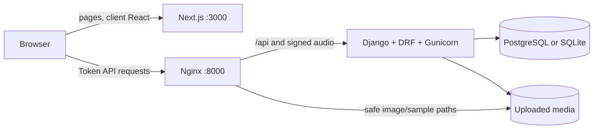

# SoundWave Codebase Catch-Up Guide

This is the code-oriented companion to the root `README.md`. The README is the delivery and requirements overview; this document is the map a developer should read before changing the system. It describes the repository as it exists at commit `756ca80`, based on the implementation, migrations, tests, and existing documentation.

## 1. The system in one page

SoundWave is a role-aware music streaming application with four user roles:

- **Listener:** consumes music, follows users/artists, manages playlists, changes preferences, buys subscriptions, and opens support tickets.
- **Approved artist:** gets listener capabilities plus a public artist profile, release management, live statistics, and private accounting.
- **Support:** reviews artist applications and manages all support tickets, but cannot see artist financial records, change pricing, generate accounting, or settle payouts.
- **Administrator:** is Django's single active superuser and can perform every support action plus pricing, platform reporting, accounting generation, and settlement.

There are also three subscription tiers:

| Capability | Basic | Silver | Gold |
|---|---:|---:|---:|
| Counted streams per local day | 60 | Unlimited | Unlimited |
| Playlists | 6 | 100 | Unlimited |
| Profile image upload | No | Yes | Yes |
| Track download | No | Yes | Yes |
| Future early-access releases | No | No | Yes |
| Advanced artist/track statistics | No | No | Yes |

The browser renders a Next.js App Router application and stores a DRF authentication token in `localStorage`. Runtime pages call the Django REST API; PostgreSQL is the Docker database, while local non-Docker development falls back to SQLite. Uploaded media is stored by Django. Nginx serves ordinary media but refuses direct track-audio paths, so playback and downloads must go through a signed Django endpoint.



The most important architectural boundary is this: React presents state and sends intent; Django decides identity, visibility, ownership, subscription access, stream validity, payment results, and financial totals.

## 2. Where things live

```text
app/                    Route-level React pages (all interactive pages are client components)
components/layout/      Auth, application, dashboard, sidebar, topbar, bottom-player shells
components/player/      HTML-audio player, queue, seek, shuffle, repeat, lyrics, stream reporting
components/shared/      Domain cards, page header, empty state, stats, chart, confirmation dialog
components/ui/          Primitive Button/Card/Input/Modal/Select/Table/Tabs/etc.
config/                 Frontend navigation and client-side access declarations
constants/              Static app settings and display labels
data/                   Legacy Phase 1 mock fixtures; not runtime database data
features/account/       Account, preferences, notification, plan, and payment API wrappers
features/music/         Catalog, artist, playlist, playback, stream, and upload API wrappers
features/operations/    Application, support, report, pricing, and settlement API wrappers
hooks/                  Very small context convenience hooks
lib/                    Shared API client, auth helpers, permissions, formatting, legacy storage
providers/              Auth, preferences, player, and in-memory app-settings state
public/mock/            Phase 1 mock images/audio retained for tests and demonstrations
tests/                  Node frontend helpers/component/API-contract tests
types/                  Shared TypeScript domain and navigation contracts

backend/config/         Settings plus root URL/ASGI/WSGI entry points
backend/common/         Timestamp base model, DRF errors, pagination, health, shared role permissions
backend/accounts/       Identity-adjacent profiles, preferences, follows, auth, password reset, deletion
backend/artists/        Applications, portfolio samples, approval, and approved profiles
backend/music/          Genres, albums, tracks, protected media, streams, history, recommendations
backend/playlists/      Playlists, ordered items, playback history, and tier limits
backend/operations/     Subscription plan rules, dynamic prices, and price audit history
backend/subscriptions/  Purchases, gateway adapters, activation/renewal, warning, and expiry
backend/notifications/  Persistent notifications plus cross-domain signal receivers
backend/support/        Tickets, messages, internal notes, assignment, and status transitions
backend/reports/        Stream-based accounting, settlement, and role-specific aggregates
```

Each backend domain generally follows the same pattern:

1. `models.py` owns persisted state and database invariants.
2. `serializers.py` translates camel-case JSON/multipart contracts and validates input.
3. `services.py` owns transactional business workflows.
4. `views.py` handles HTTP, query scoping, and permission selection.
5. `signals.py` declares domain events; notification receivers react without direct domain coupling.
6. `tests/` exercises the HTTP contract and important business boundaries.

## 3. Runtime entry points and configuration

### Frontend boot

`app/layout.tsx` installs `AppProviders` around every route. Provider nesting is deliberate:

```text
AppSettingsProvider
  AuthProvider
    UserPreferencesProvider
      PlayerProvider
        route content
```

`AuthProvider` must precede preferences and player because both reload state when the current user changes. `MainAppLayout` then performs the client-side authentication and role checks, renders navigation, and mounts the persistent bottom player.

Important frontend configuration:

- `NEXT_PUBLIC_API_BASE_URL` defaults to `http://127.0.0.1:8000/api` in `lib/api.ts`.
- The example `.env.local` uses that same local API address.
- `next.config.mjs` currently only adds one allowed development origin (`10.161.194.237`).
- TypeScript is strict, uses bundler resolution, and maps `@/*` to the repository root.
- Tailwind scans `app`, `components`, `features`, `hooks`, and `providers`; the visual theme is a dark purple SoundWave palette.
- Root metadata still says `SpotifyWannaBe`, while visible navigation says `SoundWave`.

### Backend boot

`backend/manage.py` targets `config.settings`. `backend/config/settings.py`:

- loads `backend/.env`;
- chooses PostgreSQL when `POSTGRES_DB` is non-empty, otherwise SQLite at `backend/db.sqlite3`;
- enables token and session authentication;
- requires authentication by default;
- uses page-number pagination with a default of 20 and maximum requested page size of 100;
- wraps DRF errors as `{ "error": { "status", "message", "details" } }`;
- serves `/media/` directly only while Django `DEBUG` is true;
- defaults email delivery to the console backend;
- uses UTC for persisted/backend time calculations.

`backend/config/urls.py` exposes Django admin at `/admin/`, health at `/api/health/`, and nine domain API prefixes under `/api/`.

### Docker delivery topology

`docker-compose.yml` starts:

- `database`: PostgreSQL 16 Alpine with a persistent named volume;
- `backend`: Python 3.13, migrations, static collection, then three Gunicorn workers;
- `gateway`: Nginx on host port 8000, proxying Django and serving safe media/static paths;
- `frontend`: a Node 20 multi-stage production build on host port 3000.

Nginx permits uploads slightly above the backend's 200 MiB track limit, disables buffering for long uploads, supports long backend reads, and returns 404 for direct `/media/music/tracks/<artist>/audio/...` requests. The Django signed file endpoint implements byte ranges itself for browser seeking.

## 4. Frontend architecture

### 4.1 API client and contracts

`lib/api.ts` is the single request boundary. It:

- prefixes paths with the configured API base URL;
- attaches `Authorization: Token <token>` unless explicitly disabled;
- automatically distinguishes JSON from `FormData`;
- disables fetch caching;
- parses JSON/text responses;
- clears the stored token on HTTP 401;
- throws `ApiError` with status and backend details;
- serializes non-empty query parameters with `toQuery`.

Feature modules keep endpoint strings out of pages:

- `features/account/api.ts`: registration, login/logout, current profile, public user, preferences, follow/unfollow, password-reset request, anonymization.
- `features/account/notifications.ts`: list/read/read-all/delete notifications.
- `features/account/plans.ts` and `subscriptions.ts`: public plans, current subscription, payment initiation and verification.
- `features/music/api.ts`: catalog, home, history, playback, download, stream reporting, playlists, artists, genres, and artist release CRUD.
- `features/operations/api.ts`: applications, support tickets, reports, accounting, settlement, approved artists, and price updates.

The API intentionally emits camel-case fields even though Django models use snake case. IDs are represented as strings in TypeScript. The shared types in `types/domain.ts` cover the stable cross-feature shapes; endpoint-specific response shapes stay beside their feature API.

### 4.2 Global state

`AuthProvider` is the source of current runtime identity. On mount it checks for a stored token and requests `/accounts/me/`. Login and registration store the token; logout, account deletion, invalid startup auth, and any API 401 remove it.

`UserPreferencesProvider` fetches persistent preferences after authentication. It:

- sets document `lang` and `dir` (`fa` becomes RTL);
- exposes a small English-to-Persian `t()` dictionary;
- optionally synthesizes a short Web Audio click for buttons and links.

`PlayerProvider` fetches the visible track catalog after authentication and owns the shared `PlayerState`. If the selected track disappears from the refreshed catalog, it resets to the first visible track.

`AppSettingsProvider` only stores the static `APP_SETTINGS` object in memory. It is leftover scaffolding and is not connected to a backend settings endpoint.

### 4.3 Layout and access behavior

Authentication pages use `AuthLayout`. App pages use `MainAppLayout`; dashboards wrap that with `DashboardLayout`. `MainAppLayout` waits for auth startup, redirects anonymous users to `/login?next=<path>`, checks `config/access.ts`, and renders sidebar/topbar/player for authorized users.

Client route access is a usability layer, not the security boundary. The backend rechecks permissions. A notable detail is that `/support` is intentionally available to every authenticated role: ordinary users see their own help center, while staff see the operational workspace.

Sidebar items are defined in `config/navigation.ts`, filtered by role, and split into primary, workspace, and account sections. Mobile navigation is a fixed horizontal bar. The top bar shows the session identity, role, subscription tier, account links, and logout.

### 4.4 Route map

| Route | Main behavior and API dependencies |
|---|---|
| `/login` | Shared email/password login, then role-specific or validated `next` redirect. |
| `/signup` | Listener JSON registration or multipart artist registration with a required sample file/link and privacy acceptance. |
| `/forgot-password` | Sends a non-enumerating reset request. There is no reset-confirmation page in this frontend. |
| `/` | Home API plus latest albums: recent tracks/playlists, deterministic recommendations, early access for Gold, trending/latest releases, upgrade prompt. |
| `/music` | Debounced track/album search and ordering; also consumes notification `?track=` links and playlist `?addToPlaylist=` selection mode. |
| `/music/album/[id]` | Album metadata, visible tracks, queue creation, play, and pseudo-random shuffle selection. |
| `/artist/[id]` | Artist public profile, follow state, tier-gated statistics, filtered tracks and albums. |
| `/playlists` | Own playlist CRUD, cover/public fields, track removal, play history, and add-track navigation into `/music`. |
| `/profile` | Own display name, birth date, gender, and paid-tier avatar update. |
| `/profile/[id]` | Public account summary and follow/unfollow. |
| `/settings` | Persistent language/sound/notification flags, public plan prices, payment initiation, and account anonymization. |
| `/payment/callback` | Public callback verifier; refreshes current user after success. |
| `/notifications` | Own persistent notifications, unread count, mark one/all read, and delete. |
| `/artist-dashboard` | Own profile editing; single/album multipart upload; draft/publish/edit/delete; live overview and revenue records. |
| `/support` | Users create/read/reply to own tickets. Support/admin get queue stats, all tickets, internal notes, status actions, and pending application review. |
| `/admin` | Dynamic Silver/Gold pricing, stream-derived revenue generation, payout settlement, subscription/sales/accounting/support reports. |

### 4.5 Player and stream reporting

`components/player/PlayerShell.tsx` is the most stateful frontend component. It uses one HTML `<audio>` element and:

- requests a one-hour signed playback URL whenever the current track changes;
- stores queue IDs in `soundwave_active_queue` and supports selecting, moving, and removing entries;
- implements play/pause, seek, volume, previous/next, shuffle, repeat-all, and repeat-one;
- exposes queue and lyrics panels on desktop and an expanded mobile player;
- creates a unique session per selected track;
- first registers the session with zero seconds, then reports progress about every ten seconds and on pause/end;
- stops playback when the backend returns a 403, including the Basic daily limit.

The browser's seconds are not trusted directly. The backend caps reported progress by the real wall-clock time since the stream session was created, plus a three-second grace period, and by track duration.

`TrackCard` starts a selected/context queue, toggles tracks in playlists, and shows downloads only for Silver/Gold users. The backend still rechecks every action.

### 4.6 Legacy frontend material

The `data/` directory, `lib/auth.ts` mock credential helpers, `lib/playlist-storage.ts`, and `public/mock/` assets remain for Phase 1 regression tests. Runtime authentication, playlists, music, dashboards, and preferences use Django APIs.

Do not treat the mock users, credentials, playlists, notifications, tickets, prices, or revenue rows as seed data. They are never loaded into the runtime database.

## 5. Backend domains and data model

Most mutable domain rows inherit `TimestampedModel` (`created_at`, `updated_at`). Django's built-in `User` is the identity root; this avoids a mid-project custom-user migration.

### 5.1 Accounts

Models:

- `UserProfile`: one-to-one display name, optional birth date, gender, and avatar.
- `UserPreference`: one-to-one language, click sound, global notification switch, and billing/release/support notification switches.
- `UserFollow`: directed user-to-user relationship with unique and no-self-follow constraints.

Role derivation is computed when serializing a user: active superuser -> admin; `support` group -> support; approved `ArtistProfile` -> artist; otherwise listener. A post-save signal creates profile/preferences for every new user. A pre-save signal rejects a second active superuser.

Registration normalizes email, creates a unique username from its local part, runs Django password validators, creates the listener group membership, and returns a DRF token. Artist registration first creates a listener account, then a pending application and sample rows.

The password-reset request always returns the same response. If the user exists, Django creates a UID/token and sends it through the configured email backend. Confirmation invalidates the old auth token after changing the password.

"Delete account" is irreversible anonymization, not a database delete. It removes tokens, follows, notifications, personal media, artist application samples, and PII; disables artist approval; replaces username/email; makes the password unusable; and marks the user inactive. This preserves `PROTECT`ed payment and support-message audit history.

### 5.2 Artists

Models:

- `ArtistApplication`: UUID request, applicant, stage name, portfolio description, pending/approved/rejected status, reviewer, time, and note.
- `ArtistSampleWork`: exactly one uploaded file or external URL; uploads are isolated under the application ID.
- `ArtistProfile`: one-to-one approved public identity with stage name, bio, genre tags, images, verifier, and time.

Only one pending application per applicant is allowed. At least one sample is required. Sample uploads accept common audio/video/image/PDF extensions and are limited to 50 MiB each.

Support/admin approval locks the pending application, records review metadata, creates or updates the approved profile, adds the user to the `artist` group, and emits a result event after commit. Rejection requires a reason. A reviewed application cannot be reviewed again.

Approved profiles are authenticated-readable. Owners/admins can patch profile fields and images. Public follower count is always visible; monthly listener and total-stream statistics are returned only to the profile owner, admin, or Gold subscriber.

### 5.3 Music

Models:

- `Genre`: unique display name and slug.
- `Album`: UUID, primary artist, cover, release date, optional genre, draft/published status, early-access flag.
- `Track`: UUID, primary artist, optional album, required audio, optional cover, duration, lyrics, genre, date, track number, explicit/status/early-access flags, and collaborator artists.
- `StreamEvent`: unique `(track, listener, session_id)` with reported seconds, counted flag, and local stream date.
- `ListeningHistory`: unique `(listener, track)` with last play time and accumulated play count.

Important invariants:

- a track's album and primary artist must match;
- duration must be positive;
- album track numbers are unique;
- a normal published album needs at least two tracks;
- deleting the third-to-last track from a published two-track-minimum album is rejected;
- the atomic album-release endpoint creates the album and at least two tracks in one transaction.

Audio uploads allow MP3, WAV, FLAC, M4A, and OGG up to 200 MiB. Validation checks extension, declared MIME type when present, and the file header signature. Catalog serializers never expose raw audio storage URLs.

Visibility is computed per authenticated user:

- owners and admin can access their own/all drafts and scheduled releases;
- everyone sees published releases on or before today;
- Gold additionally sees future published releases only when `is_early_access` is true;
- future published releases without early access remain hidden even from Gold.

Track/album list endpoints support search and a whitelist of ordering keys. Track list also filters by genre slug. Read serializers include nested visible album tracks and subscription/role-gated statistics.

#### Counted streams

A stream counts at 30 verified seconds. Registering a new session creates an uncounted zero-second row; later reports update the same row. The service uses `select_for_update`, never lets a counted session become uncounted, and locks the listener during the Basic daily-limit check. A newly counted stream creates or increments listening history.

The home recommender excludes already-listened tracks, scores primary-artist affinity at 5 per history weight and genre affinity at 3, then uses counted popularity, release date, and title as deterministic tie-breakers. Cold-start users receive popularity-based results.

#### Protected audio

Playback/download actions return Django-signed URLs containing user ID, track ID, and purpose. Tokens expire after one hour. The public file endpoint verifies the signature and current subscription/visibility again, supports one byte range, sets private/no-store headers, and chooses inline versus attachment disposition by purpose.

### 5.4 Playlists

Models:

- `Playlist`: UUID owner, unique owner/title pair, description, cover, and public flag.
- `PlaylistItem`: unique playlist/track and playlist/order pairs, adding user, and sort order.
- `PlaylistPlayback`: unique user/playlist recent-play state and count.

Users list their own plus public playlists, but only owners/admin can mutate a playlist. Creation reads the current plan from the backend and enforces the tier count. Adding a track is idempotent, removal compacts order, and reordering requires every current track exactly once. The reorder service temporarily offsets sort positions to avoid uniqueness collisions.

Playlist serializers omit tracks that the current user cannot presently access. Marking a playlist played updates home-page recency.

### 5.5 Operations and subscription plans

`SubscriptionPlan` persists tier price and fixed capabilities. `SubscriptionPriceChange` is a protected audit row containing old/new prices and administrator.

A post-migrate receiver creates missing default plans:

- Basic: USD 0, six playlists, no paid features;
- Silver: USD 6.99, 100 playlists, profile images and downloads;
- Gold: USD 11.99, unlimited playlists and every paid feature.

Model validation prevents changing the tier capability matrix or making paid plans non-positive. Basic cannot be updated through the API. Plan list/retrieve/quotes are public; partial price update and audit history are admin-only. Quotes support 1, 3, 6, or 12 months and multiply the current monthly price without discounts.

### 5.6 Subscriptions and payments

Models:

- `UserSubscription`: user, protected plan, starts/ends time, active/expired/canceled status.
- `PaymentTransaction`: protected user/plan, period, snapshotted amount/currency, pending/success/failed/canceled state, gateway data, authority, reference, and verification time.

Payment initiation validates paid tier and period, snapshots the current price into a pending transaction, then calls the configured adapter:

- `LocalSandboxGateway` creates a `LOCAL-*` authority and directs the browser straight to the callback with `Status=OK`.
- `ZarinpalGateway` requires a merchant ID and IRR pricing, posts request/verification JSON, and accepts gateway codes 100/101.

Verification locks the transaction and is idempotent after success. Failure/cancellation never activates a plan. Success marks the transaction verified, chooses the later of now or the current subscription end as the extension base, cancels the old active row if present, and creates a new active subscription using calendar-month arithmetic.

Subscription lifecycle processing expires ended rows and emits at most one matching seven-day warning per subscription end message. It runs when subscription-aware helpers or notification listing are called and is also exposed as `python manage.py process_subscription_expiry` for a production scheduler.

### 5.7 Notifications

`Notification` is a recipient-owned UUID row with category, title, message, action path, and optional read time. Users can list/retrieve/delete only their own, mark one read, or mark all read.

Notification preferences are checked at creation. The global switch suppresses everything; billing, followed-release, and support switches suppress their categories. Artist account approval/rejection uses the separate `artist` category, so disabling followed-artist release notifications does not hide an account decision.

Receivers create notifications after these domain events:

- artist application submitted -> support users and admin;
- application reviewed -> applicant;
- track first becomes published -> followers of the artist's user account;
- ticket created -> support users and admin;
- public ticket message -> requester or assigned support user;
- ticket status change -> requester;
- revenue record generated/settled -> artist.

Internal ticket notes deliberately generate no user notification.

### 5.8 Support

Models:

- `Ticket`: requester, optional assignee, subject, priority, status, and closed time.
- `TicketMessage`: protected sender, body, and internal-note flag.

Ordinary users only query/retrieve their own tickets. Staff see all and can filter by status, priority, assignment, search, and ordering. Internal notes are removed from non-staff detail responses.

Ticket creation atomically creates the initial public message. Staff public replies auto-assign an unassigned ticket and move it to `waiting_for_user`; staff internal notes do neither. A requester reply reopens waiting/resolved/closed tickets. Status transitions use an explicit state table: closed tickets can only reopen, resolved can reopen/close, and open/waiting can move among the appropriate active/final states. Only staff can assign or change status, and assignees must themselves be support/admin.

### 5.9 Reports and artist accounting

`ArtistRevenueRecord` stores one protected artist-period aggregate: listener/stream totals, gross/fee/net cents, currency, calculation note, per-track JSON breakdown, pending/settled state, and settlement actor/time. The model derives net as gross minus fee and validates period, fee, and settlement metadata. The service rejects any overlapping period for the artist, which is stronger than the exact-period database unique constraint.

Only approved artists and admin can list records. Artists are scoped to their own profile; support has no financial access. Only admin can generate or settle.

Generation queries counted `StreamEvent` rows and computes:

```text
gross = streams * per_stream_cents
      + unique_listeners * per_unique_listener_cents
platform_fee = floor(gross * platform_fee_percent / 100)
net = gross - platform_fee
```

Rates, currency, period, and fee percent are explicit administrator input because the course specification omitted fixed numeric rates. The per-track breakdown uses the same formula and reconciles integer rounding to the aggregate fee.

Overview services perform aggregation in Django:

- artist overview: live streams/listeners for the period, record/payment counts, currency totals, and per-track revenue;
- support overview: ticket/application status counts plus urgent/unassigned active tickets;
- admin overview: accounting totals, approved/pending artists, current tier distribution, verified subscription sales by currency/tier, and support overview.

Default report period is the first day of the current backend-local month through today.

## 6. REST API map

All endpoints except the explicitly public ones use DRF authentication. Router list endpoints normally end in `/` and paginate unless noted.

### Common and accounts

| Method | Path | Access / purpose |
|---|---|---|
| GET | `/api/health/` | Public health response. |
| POST | `/api/accounts/register/listener/` | Public listener registration. |
| POST | `/api/accounts/register/artist/` | Public multipart artist registration/application. |
| POST | `/api/accounts/login/` | Public token login. |
| POST | `/api/accounts/logout/` | Delete current token. |
| GET/PATCH/DELETE | `/api/accounts/me/` | Own profile; DELETE anonymizes/deactivates. |
| GET/PATCH | `/api/accounts/preferences/` | Own persisted preferences. |
| POST | `/api/accounts/password-reset/` | Public non-enumerating reset email. |
| POST | `/api/accounts/password-reset/confirm/` | Public UID/token password change. |
| GET | `/api/accounts/users/{id}/` | Authenticated public user profile. |
| POST/DELETE | `/api/accounts/users/{id}/follow/` | Follow/unfollow. |

### Artists and music

| Method | Path | Access / purpose |
|---|---|---|
| GET/POST | `/api/artists/applications/` | Own applications; staff see all; authenticated create. |
| GET | `/api/artists/applications/{id}/` | Same scope as list. |
| POST | `/api/artists/applications/{id}/review/` | Support/admin approve or reject. |
| GET | `/api/artists/profiles/` and `/{id}/` | Approved profiles. |
| PATCH | `/api/artists/profiles/{id}/` | Owner/admin public profile edit. |
| GET | `/api/music/genres/` | Authenticated, unpaginated genre list. |
| GET/POST/PATCH/DELETE | `/api/music/albums/` and `/{id}/` | Visible catalog; writes for approved owner/admin. |
| POST | `/api/music/albums/release/` | Atomic album plus at least two tracks. |
| GET/POST/PATCH/DELETE | `/api/music/tracks/` and `/{id}/` | Visible catalog; writes for approved owner/admin. |
| POST | `/api/music/tracks/{id}/stream/` | Register/update verified session progress. |
| GET | `/api/music/tracks/{id}/stats/` | Gold, owner, or admin. |
| GET | `/api/music/tracks/{id}/playback/` | Signed playback URL. |
| GET | `/api/music/tracks/{id}/download/` | Silver/Gold signed download URL. |
| GET | `/api/music/tracks/{id}/file/?token=...` | Public transport endpoint with signed authorization. |
| GET | `/api/music/history/` | Own paginated listening history. |
| GET | `/api/music/home/` | Home sections and recommendations. |

### Playlists, plans, and subscriptions

| Method | Path | Access / purpose |
|---|---|---|
| GET/POST/PATCH/DELETE | `/api/playlists/` and `/{id}/` | Own/public reads; owner/admin writes. |
| POST | `/api/playlists/{id}/tracks/` | Add an accessible track. |
| DELETE | `/api/playlists/{id}/tracks/{trackId}/` | Remove and compact. |
| POST | `/api/playlists/{id}/reorder/` | Replace full order. |
| POST | `/api/playlists/{id}/played/` | Update recent playlist history. |
| GET | `/api/operations/subscription-prices/` and `/{tier}/` | Public plan data. |
| GET | `/api/operations/subscription-prices/{tier}/quote/?months=N` | Public quote. |
| PATCH | `/api/operations/subscription-prices/{tier}/` | Admin price update. |
| GET | `/api/operations/subscription-price-changes/` | Admin audit history. |
| GET | `/api/subscriptions/current/` | Own current active plan or Basic fallback. |
| GET | `/api/subscriptions/payments/` and `/{id}/` | Own transactions. |
| POST | `/api/subscriptions/payments/initiate/` | Create pending paid-tier transaction. |
| GET | `/api/subscriptions/payments/callback/` | Public idempotent gateway callback. |

### Notifications, support, and reports

| Method | Path | Access / purpose |
|---|---|---|
| GET/DELETE | `/api/notifications/` and `/{id}/` | Own notifications. |
| POST | `/api/notifications/{id}/read/` | Mark one read. |
| POST | `/api/notifications/read-all/` | Mark all read. |
| GET/POST | `/api/support/tickets/` | Own tickets or all for staff; create ticket. |
| GET | `/api/support/tickets/{id}/` | Scoped conversation. |
| POST | `/api/support/tickets/{id}/messages/` | Public reply or staff internal note. |
| PATCH | `/api/support/tickets/{id}/status/` | Staff status transition. |
| PATCH | `/api/support/tickets/{id}/assignment/` | Staff assignment. |
| GET | `/api/reports/artist-revenue/` and `/{id}/` | Own artist records or all for admin. |
| POST | `/api/reports/artist-revenue/generate/` | Admin stream-derived record. |
| POST | `/api/reports/artist-revenue/{id}/settle/` | Admin settlement. |
| GET | `/api/reports/artist/overview/` | Approved artist. |
| GET | `/api/reports/support/overview/` | Support/admin. |
| GET | `/api/reports/admin/overview/` | Admin. |

## 7. Important end-to-end flows

### Artist onboarding

```text
/signup multipart form
  -> account registration + profile/preferences signal
  -> pending ArtistApplication + sample rows
  -> after-commit application-submitted signal
  -> notifications for support/admin
  -> staff review action locks application
  -> approved ArtistProfile + artist group
  -> result notification
  -> /artist-dashboard becomes usable after identity refresh/login
```

### Playback to accounting

```text
track selection
  -> signed playback URL
  -> protected byte-range file response
  -> session creation and periodic seconds reports
  -> server wall-clock verification
  -> counted StreamEvent after 30 seconds
  -> ListeningHistory update
  -> recommendation/report inputs
  -> admin revenue generation
  -> pending ArtistRevenueRecord + artist notification
  -> admin settlement + artist notification
```

### Subscription purchase

```text
/settings plan + months
  -> pending PaymentTransaction with price snapshot
  -> gateway URL
  -> /payment/callback query
  -> backend verification under transaction lock
  -> old active subscription canceled if present
  -> new active subscription extends from later of now/current end
  -> frontend refreshes /accounts/me
  -> tier-dependent serializers and permissions change immediately
```

### Ticket conversation

```text
user creates ticket + initial message
  -> staff notification
  -> staff public reply: auto-assign + waiting_for_user
  -> user notification
  -> user reply: reopen to open
  -> staff may add invisible internal notes
  -> staff status change
  -> requester notification
```

## 8. Testing and verification

### Frontend

`npm run test` uses Node's native test runner with `tests/setup.cjs`. The setup registers TypeScript/TSX transpilation and mocks Next Link/navigation. Tests cover:

- auth normalization, mock regression authentication, redirects, and navigation filtering;
- formatting and subscription helpers;
- local mock asset/fixture integrity;
- reusable page header, button, badge, empty state, table, chart, track, and album rendering;
- legacy per-user playlist storage;
- exact API requests for home, accounting generation, and stream progress.

Frontend checks are:

```powershell
npm run test
npm run type-check
npm run lint
npm run build
```

### Backend

Django API tests are split by domain and cover health, auth/profile/follows/preferences, single-admin enforcement, application visibility/review, upload access, early releases, signed audio contracts, anti-forged stream progress, daily stream limits, recommendations, playlist ownership/limits/visibility, plan rules/audits, payment activation and calendar arithmetic, notification ownership/preferences, ticket scoping/transitions/internal notes, report permissions/aggregation, generation, and settlement.

Backend checks are:

```powershell
cd backend
python manage.py makemigrations --check --dry-run
python manage.py check
python manage.py test -v 2
```

Tests use temporary databases. Artist upload tests also use a temporary media root. They do not populate the normal development database.

## 9. Running locally

The complete setup and reproducible role bootstrap command are in the root `README.md`. The shortest paths are:

### Docker (recommended)

```powershell
docker compose up -d --build
docker compose ps
```

Then open frontend `http://localhost:3000`, health `http://localhost:8000/api/health/`, or Django admin `http://localhost:8000/admin/`.

### Without Docker

Copy `.env.local.example` to `.env.local` and `backend/.env.example` to `backend/.env`, install `npm ci` and backend requirements into a virtual environment, run migrations, then start:

```powershell
# terminal 1, from backend/
python manage.py runserver 127.0.0.1:8000

# terminal 2, from repository root
npm run dev
```

Leaving `POSTGRES_DB` empty selects SQLite. The local payment sandbox is the default.

## 10. Where to make a change

| Change | Start here | Also inspect |
|---|---|---|
| Authentication/profile fields | `backend/accounts/` | `features/account/api.ts`, `providers/AuthProvider.tsx`, `types/domain.ts`, profile pages |
| Role behavior | `backend/common/permissions.py`, `accounts/serializers.py` | `config/access.ts`, `config/navigation.ts`, relevant view permissions/tests |
| Subscription capability | `backend/operations/models.py` and bootstrap signal | `subscriptions/services.py`, feature serializer/service, `config/access.ts`, UI visibility |
| Catalog visibility | `backend/music/views.py`, `music/services.py` | album/playlist serializers, player, music tests |
| Release metadata/upload | `backend/music/models.py` and serializers | artist API/dashboard, domain types, Nginx size limits |
| Stream/counting rule | `backend/music/services.py` | player reporting, reports, music tests |
| Playlist behavior | `backend/playlists/` | music API, playlists page, TrackCard |
| Notification event | emitting domain signal + `notifications/receivers.py` | preference mapping, action route, tests |
| Ticket workflow | `backend/support/services.py` | support serializers/page, notifications |
| Pricing/payment | `backend/operations/`, `backend/subscriptions/` | settings/admin pages, plan/payment API modules |
| Accounting/report formula | `backend/reports/services.py` | report serializers, admin/artist dashboards, tests |
| Shared visual component | `components/ui/` or `components/shared/` | Node component tests and every call site |

For schema changes, update the model, generate a migration, update serializers/services, add focused tests, then align TypeScript contracts and the consuming page.

## 11. Known boundaries, inconsistencies, and sharp edges

These details matter because several are easy to miss when reading only the root README:

1. **Runtime data is not committed.** A clone contains migrations, default-plan bootstrap, and legacy mock assets, but no real users, uploads, streams, transactions, or report history.
2. **Most pages only consume the first API page.** DRF defaults to 20 rows. The UI does not provide general pagination or automatically follow `next`, so larger catalogs/ticket queues/report lists can be incomplete on screen.
3. **Frontend route checks are incomplete by design.** Pages without an explicit access rule pass `canAccessRoute`; backend authorization remains authoritative. `/support` must stay available to ordinary users for their own tickets.
4. **Frontend tier constants duplicate backend plan capabilities.** `config/access.ts` is used for UI affordances; database plans/services are authoritative. A capability change must keep both in sync.
5. **Gold >= Silver is enforced only in the admin page.** Backend model/service validation requires each paid price to be positive but does not compare Gold with Silver. API clients outside this UI can set Gold lower.
6. **Debug media differs from Docker.** Nginx blocks raw track-audio paths, but Django debug static-media serving appends `/media/` routes and does not replicate that Nginx block. Treat the Docker gateway as the delivery security topology.
7. **Signed URLs are bearer links for one hour.** The signature binds a user/track/purpose and rechecks the user's current entitlement, but the file request itself has no auth header. Anyone holding an unexpired link can request it while the encoded user remains entitled.
8. **Payment callback is public and GET-based.** Security relies on unguessable authority plus server-side gateway verification. The frontend callback can verify without a stored token and only refreshes identity if a token is present.
9. **Password recovery is backend-complete but frontend-partial.** `/forgot-password` requests mail, and the backend has a confirmation endpoint, but the repository has no reset-confirmation page or UID/token entry UI. The console email exposes the raw values in local development.
10. **No periodic worker is included.** Subscription expiry is request-driven plus an idempotent management command. Production must schedule it externally.
11. **No database seed command exists.** Default plans are created by `post_migrate`; demo roles/content require the README bootstrap/manual workflow.
12. **Media replacement cleanup is limited.** Account anonymization explicitly deletes personal/sample files, but generic track/album/playlist/profile replacement and row deletion do not consistently remove old storage objects.
13. **Persian localization is frontend-managed.** The shared UTF-8 translation catalog now covers the application UI, persists the selected language, switches the document to RTL, and supplies the `fa-IR` locale for dates, numbers, and currencies. Backend-provided content and API error messages remain server-authored and may still be English.
14. **Legacy helpers are still tested.** `lib/auth.ts`, `lib/playlist-storage.ts`, and `data/` should not be used for new runtime features even though their regression tests still pass.
15. **Player state is split.** Selected track/queue/play state lives in `PlayerProvider`; queue contents, progress, stream URL, shuffle, and repeat also live locally in `PlayerShell`. `PlayerState.repeatMode` and `shuffleEnabled` are not the values currently driving playback.
16. **Player catalog is one page.** The provider loads only the first track page, so a track loaded through another paginated context may need a catalog refresh and still may not be present in the player's in-memory list.
17. **Public playlist reads require authentication.** `is_public` means visible to other signed-in users, not anonymous internet access.
18. **Application approval and support actions are API-audited, but not every admin UI feature exists.** The admin page focuses on prices, reports, accounting, and settlements; Django admin remains the broad low-level data console.
19. **The Phase 2 report draft's old statement that Support can read accounting should not be followed.** Current permissions and tests intentionally restrict artist financial records to the relevant approved artist and administrator.
20. **Current identity serialization can be query-heavy.** Counts, subscription lifecycle checks, role groups, and daily stream counts are computed while serializing users. This is fine for single-user endpoints but should be profiled before adding a user-list API.
21. **Publishing a scheduled/early-access track notifies every follower immediately.** The release signal fires when status first becomes `published`, without filtering recipients by release date or subscription tier. Basic/Silver followers can therefore receive an "available" notification whose target is still hidden from them.
22. **Artist account anonymization does not remove releases.** The artist profile is renamed, stripped, and unapproved, while existing albums/tracks and their media remain. Published tracks can still appear under "Deleted artist", but the linked artist profile is hidden by the approved-profile query.
23. **Ticket assignment has a backend endpoint but no direct UI control.** The support page relies on automatic assignment after a staff public reply; explicit reassignment/unassignment currently requires an API client or Django admin.

## 12. Suggested reading order for a new developer

1. Root `README.md` for product requirements, setup, demo roles, and delivery context.
2. This guide for the system map and caveats.
3. `types/domain.ts`, `lib/api.ts`, and the three `features/*/api.ts` areas for frontend contracts.
4. `app/layout.tsx`, `AppProviders`, `AuthProvider`, `MainAppLayout`, and `PlayerShell` for client runtime state.
5. `backend/config/settings.py`, root URLs, and `common/` for backend defaults.
6. For a feature, read in this order: models -> services -> serializers -> views/URLs -> tests -> corresponding feature API -> route page.
7. Read cross-domain signal receivers when changing artist review, publishing, tickets, subscriptions, or accounting.
8. Run the focused test module before editing, then the full verification set before merging.

Once this map is familiar, most changes are local: Django apps own business truth, feature API modules own transport details, providers own cross-page client state, and pages compose those pieces into role-specific workflows.
